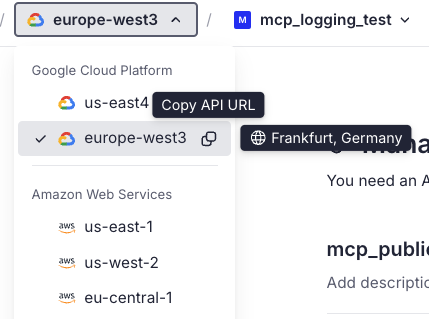
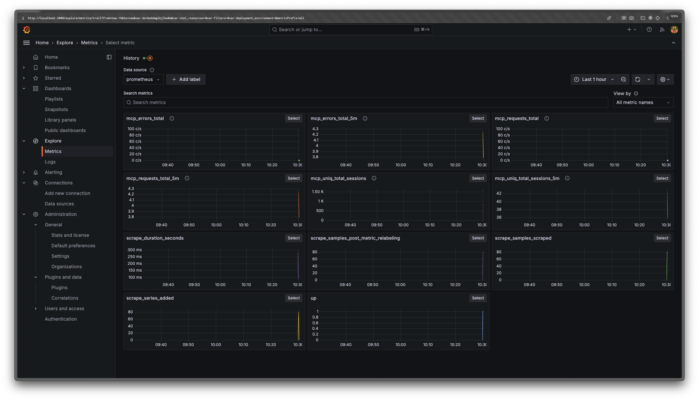

# Tinybird MCP Analytics

This is a Tinybird project that collects and stores MCP logs and metrics.

## Quickstart

Click the button below to deploy the project to your Tinybird Workspace.

<p align="center">
  <a href="https://app.tinybird.co?starter_kit=https://github.com/tinybirdco/mcp-tinybird/mcp-analytics">
    
  </a>
</p>

## Logging a MCP server using the Python SDK

Add the following to your `requirements.txt` file:

```
tinybird-python-sdk>=0.1.6
```

Configure the logging handler:

```python
import logging
from multiprocessing import Queue
from tb.logger import TinybirdLoggingQueueHandler
from dotenv import load_dotenv

load_dotenv()
TB_API_URL = os.getenv("TB_API_URL")
TB_WRITE_TOKEN = os.getenv("TB_WRITE_TOKEN")

logger = logging.getLogger('your-logger-name')
handler = TinybirdLoggingQueueHandler(Queue(-1), TB_API_URL, TB_WRITE_TOKEN, 'your-app-name', ds_name="mcp_logs_python")
formatter = logging.Formatter('%(asctime)s - %(name)s - %(levelname)s - %(message)s')
handler.setFormatter(formatter)
logger.addHandler(handler)
```

Your `TB_WRITE_TOKEN` can be found in the [Tinybird dashboard](https://app.tinybird.co/tokens) with the name `mcp_public_write_token`.

Your `TB_API_URL` is the URL of your Tinybird region.



Start sending your MCP logs and errors:

```python
logger.info(f"handle_call_tool {name}", extra={**extra, "tool": name})
```

Make sure you include an extra dictionary with the `tool`, `resource`, `prompt` and `session` keys when it applies.

See logger calls [here](https://github.com/tinybirdco/mcp-tinybird/blob/main/src/mcp_tinybird/server.py)


## Logging a MCP server using the TypeScript SDK

TODO

## Exploring and visualizing logs and metrics using Grafana and Prometheus

Add this to your `prometheus.yml` file:

```yaml
scrape_configs:
  - job_name: mcp_server
    scrape_interval: 15s  # Adjust the scrape interval as needed
    scheme: 'https'
    static_configs:
      - targets: 
        - 'api.tinybird.co'  # Adjust this for your region if necessary
    metrics_path: '/v0/pipes/api_prometheus.prometheus'
    bearer_token: '<your-public-prometheus-token>'
```

Find `<your-public-prometheus-token>` in the [Tinybird dashboard](https://app.tinybird.co/tokens) with the name `prometheus`.

You should start seeing your metrics in Grafana.




## How to add more metrics

- Start sending your extra metrics from your MCP server.
- Add a new column to `mcp_monitoring.datasource`.
- Add a new `api_your_metrics.pipe` to publish your new metric and add it to the `api_prometheus.pipe`. Make sure no column is of type `Nullable(String)`.
- `api_prometheus.pipe` is a Pipe that publishes all the metrics from the MCP server.
