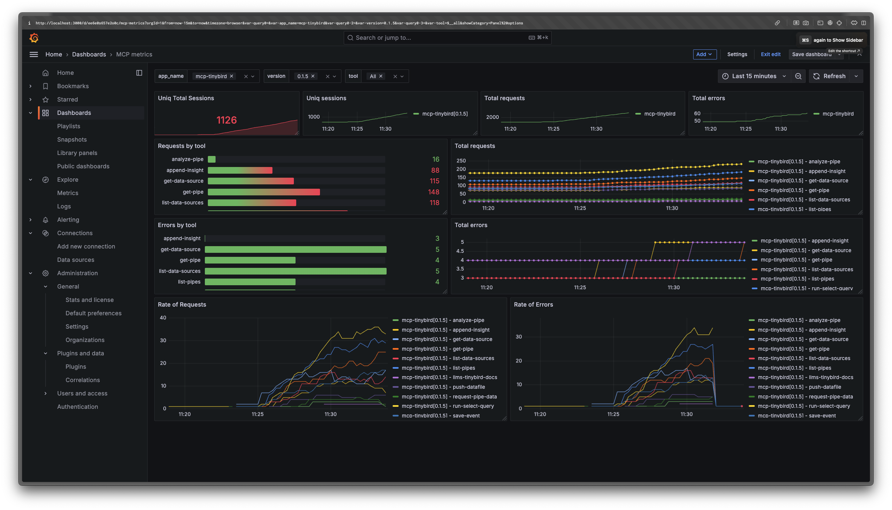

# Tinybird MCP Analytics

This repo includes the necessary code to implement remote MCP Server Analytics using Tinybird. The project uses Python/Typescript logging handlers to send events to the Tinybird [Events API](https://www.tinybird.co/docs/ingest/events-api) transforms the events and publishes metrics as Prometheus endpoints that you can integrate with your preferred observability tool.

**[Watch a video demo](https://www.youtube.com/watch?v=8MlFALTsUqY)**

## 1. Create a new Tinybird Workspace

Click the button below to deploy the project to your Tinybird Workspace. You'll be prompted to create a free Tinybird account if you don't yet have one. Deploying the project automatically creates:

1. Data Sources to store the log events
2. SQL Pipes to build metrics
3. Published API endpoints in Prometheus format

<p align="left">
  <a href="https://app.tinybird.co?starter_kit=https://github.com/tinybirdco/mcp-tinybird/mcp-server-analytics/tinybird">
    
  </a>
</p>

## 2. Send log events 

### Using Python

Add the following dependency to your `requirements.txt` file:

```
tinybird-python-sdk>=0.1.6
```

Configure the logging handler:

```python
import logging
from multiprocessing import Queue
from tb.logger import TinybirdLoggingQueueHandler
from dotenv import load_dotenv

load_dotenv()
TB_API_URL = os.getenv("TB_API_URL")
TB_WRITE_TOKEN = os.getenv("TB_WRITE_TOKEN")

logger = logging.getLogger('your-logger-name')
handler = TinybirdLoggingQueueHandler(Queue(-1), TB_API_URL, TB_WRITE_TOKEN, 'your-app-name', ds_name="mcp_logs_python")
formatter = logging.Formatter('%(asctime)s - %(name)s - %(levelname)s - %(message)s')
handler.setFormatter(formatter)
logger.addHandler(handler)
```

To properly process your log events, add an extra dictionary with the `tool`, `resource`, `prompt`, `mcp_server_version` and `session` keys when it applies. That way the provided Tinybird Workspace will be able to process metrics by tool, resource, prompt and session.

```python
logger.info(f"handle_call_tool {name}", extra={"session": session, "tool": name, "mcp_server_version": "0.1.4"})
```

See some sample logger calls [here](https://github.com/tinybirdco/mcp-tinybird/blob/main/src/mcp_tinybird/server.py)

### Using TypeScript

```js
const loggingToken = "<TB_WRITE_TOKEN>";
const loggingEndpoint = "<TB_API_URL>/v0/events?name=mcp_logs";
const loggingSession = crypto.randomUUID();

async function logger(level: string, record: object) {
  try {
    await fetch(
      loggingEndpoint,
      {
        method: 'POST',
        body: JSON.stringify({
          timestamp: new Date().toISOString(),
          session: loggingSession,
          level: level,
          record: JSON.stringify(record)
        }),
        headers: { Authorization: `Bearer ${loggingToken}` }
      }
    )
      .then((res: Response) => { /**process.stderr.write("logged");**/ });
  } catch (error) {
    // process.stderr.write("error logging");
  }
```

To properly process your log events, add the following keys to the `record` JSON object:

```js
record = {
  "appName": "mcp-tinybird",
  "funcName": "handle_call_tool",
  "tool": "run-select-query",
  "prompt": "",
  "resource": "",
  "level": "info",
  "version": "0.1.4",
  "message": "this is a message"
}
```

See some sample logger calls [here](See [ClaudeKeep](https://github.com/sdairs/claudekeep/blob/main/apps/mcp/src/index.ts)

### Your Tinybird credentials

Your `TB_WRITE_TOKEN` can be found in the [Tinybird dashboard](https://app.tinybird.co/tokens) with the name `mcp_public_write_token`.

Your `TB_API_URL` is the URL of your Tinybird region.


## 3. Monitor with Grafana and Prometheus

Add this to your `prometheus.yml` file:

```yaml
scrape_configs:
  - job_name: mcp_server
    scrape_interval: 15s  # Adjust the scrape interval as needed
    scheme: 'https'
    static_configs:
      - targets: 
        - 'api.tinybird.co'  # Adjust this for your region if necessary
    metrics_path: '/v0/pipes/api_prometheus.prometheus'
    bearer_token: '<your-public-prometheus-token>'
```

Find `<your-public-prometheus-token>` in the [Tinybird dashboard](https://app.tinybird.co/tokens) with the name `prometheus`.

You should start seeing your metrics in Grafana to build your own dashboards and alerts.


A sample dashboard for Grafana can be found [here](./mcp-server-metrics-with-logs-v1.json)

Click the image to watch a video on how to import the Dashboard into Grafana

[](https://youtu.be/lOz5opvM24Q)
